# Страница редактора

## Структура страницы
- Шапка страницы
    - Кнопка перехода на главную страницу
    - Список открытых форм
    - Кнопка создания новой формы
    - Кнопка локализации
    - Кнопка предпросмотра
    - Кнопка результатов
    - Кнопка сохранения изменений
    - Кнопка публикации
    - Кнопка профиля пользователя
- Левая панель
- Верхняя панель холста
    - Кнопка отмены действия
    - Кнопка повтора действия
    - Кнопка перемещения выше
    - Кнопка перемещения ниже
    - Кнопка трансформации элемента
- Холст формы
- Правая панель
- Элементы формы

## Шапка страницы

### Кнопка перехода на главную страницу

#### Назначение
Переход на главную страницу форм.
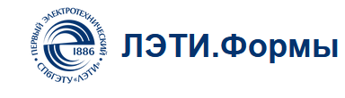

#### Что отображается
Логотип форм и название сервиса, которые находятся в левом верхнем углу страницы.

#### Поведение элемента
При нажатии происходит переход на главную страницу сервиса.

### Список открытых форм

#### Назначение
Отображение форм, которые открыты в редакторе.

#### Что отображается
В центральной части шапки отображаются вкладки открытых форм. На каждой вкладке видно название формы и кнопка закрытия вкладки.
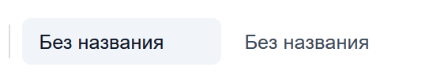

#### Поведение элемента
При нажатии на вкладку выбранная форма становится активной и открывается на холсте. При нажатии на кнопку закрытия вкладка формы закрывается. Последнюю открытую форму закрыть нельзя.

### Кнопка создания новой формы

#### Назначение
Создание новой формы из редактора.

#### Что отображается
Кнопка с иконкой плюса, расположенная рядом со списком открытых форм.
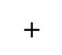

#### Поведение элемента
При нажатии создается новая форма и открывается новая вкладка редактора.

### Кнопка локализации

#### Назначение
Перевод содержимого страницы на доступные языки:
- русский язык
- английский язык

#### Что отображается
Кнопка с иконкой языка и обозначением текущего языка.
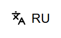

#### Поведение элемента
При нажатии язык интерфейса переключается на другой доступный язык. Перед переключением текущая форма сохраняется в локальное состояние редактора.

### Кнопка предпросмотра

#### Назначение
Просмотр формы в том виде, в котором ее будут видеть респонденты.
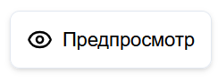

#### Что отображается
Кнопка с названием "Предпросмотр".

#### Поведение элемента
При нажатии открывается окно предпросмотра формы. В окне отображаются название формы, описание и размещенные элементы. Окно можно закрыть кнопкой закрытия предпросмотра.

### Кнопка результатов

#### Назначение
Переход на страницу просмотра результатов формы.

#### Что отображается
Кнопка с названием "Результаты".
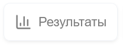

#### Поведение элемента
При нажатии происходит переход на страницу результатов формы. Кнопка недоступна, если у формы еще нет опубликованной версии.

### Кнопка сохранения изменений

#### Назначение
Сохранение изменений, внесенных в форму.

#### Что отображается
Кнопка с названием "Сохранить".
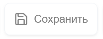

#### Поведение элемента
Кнопка становится доступной после изменения формы. При нажатии текущая структура формы сохраняется. Если изменений нет, кнопка недоступна.

### Кнопка публикации

#### Назначение
Публикация формы и настройка доступа для прохождения.

#### Что отображается
Кнопка с названием "Опубликовать".
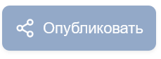

#### Поведение элемента
При нажатии открывается окно публикации. В нем можно выбрать режим доступа, дату открытия, дату закрытия и дополнительные настройки прохождения. Кнопка недоступна, если в форме нет элементов, есть несохраненные изменения или публикация невозможна для текущего состояния формы.

### Кнопка профиля пользователя

#### Назначение
Просмотр текущего аккаунта пользователя.

#### Что отображается
Кнопка профиля пользователя в правой части шапки.
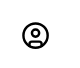

#### Поведение элемента
При нажатии появляется всплывающее окно с данными пользователя и действием выхода из аккаунта.

## Левая панель

### Назначение
В ней представлены элементы, которые вы можете размещать на странице. Детальное описание элементов смотрите в разделе "Элементы формы".

### Что отображается
Панель элементов, сгруппированных по категориям. Панель можно свернуть или развернуть. На узких экранах элементы открываются через отдельную кнопку в шапке страницы.

### Поведение
При нажатии на элемент он добавляется на активную страницу формы. Также элементы можно размещать на страницах формы с помощью перетаскивания.

## Верхняя панель холста

### Кнопка отмены действия

#### Назначение
Отмена последнего изменения формы.

#### Что отображается
Кнопка с названием "Шаг назад".
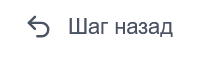

#### Поведение элемента
При нажатии отменяется последнее действие. Кнопка недоступна, если действий для отмены нет.

### Кнопка повтора действия

#### Назначение
Повтор ранее отмененного изменения формы.

#### Что отображается
Кнопка с названием "Шаг вперед".
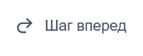

#### Поведение элемента
При нажатии повторяется последнее отмененное действие. Кнопка недоступна, если действий для повтора нет.

### Кнопка перемещения выше

#### Назначение
Перемещение выбранного элемента или выбранной страницы выше.

#### Что отображается
Кнопка с названием "Переместить выше".
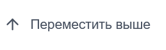

#### Поведение элемента
При нажатии выбранный элемент или выбранная страница перемещается на одну позицию выше. Кнопка недоступна, если перемещение выше невозможно.

### Кнопка перемещения ниже

#### Назначение
Перемещение выбранного элемента или выбранной страницы ниже.

#### Что отображается
Кнопка с названием "Переместить ниже".
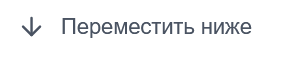

#### Поведение элемента
При нажатии выбранный элемент или выбранная страница перемещается на одну позицию ниже. Кнопка недоступна, если перемещение ниже невозможно.

### Кнопка трансформации элемента

#### Назначение
Изменение типа выбранного элемента выбора.

#### Что отображается
Кнопка с названием "Трансформировать" и выпадающий список доступных типов.
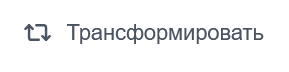

#### Поведение элемента
Кнопка доступна для элементов, которые можно преобразовать в другой тип. При выборе типа из списка элемент меняет способ отображения и сохраняет совместимые настройки.

## Холст формы

### Назначение
Основная область редактирования формы.

### Что отображается
Тут название формы, которое отображается в главном меню и респондентам при прохождении формы, тут описание и тут страницы, на которых могут находится элементы.
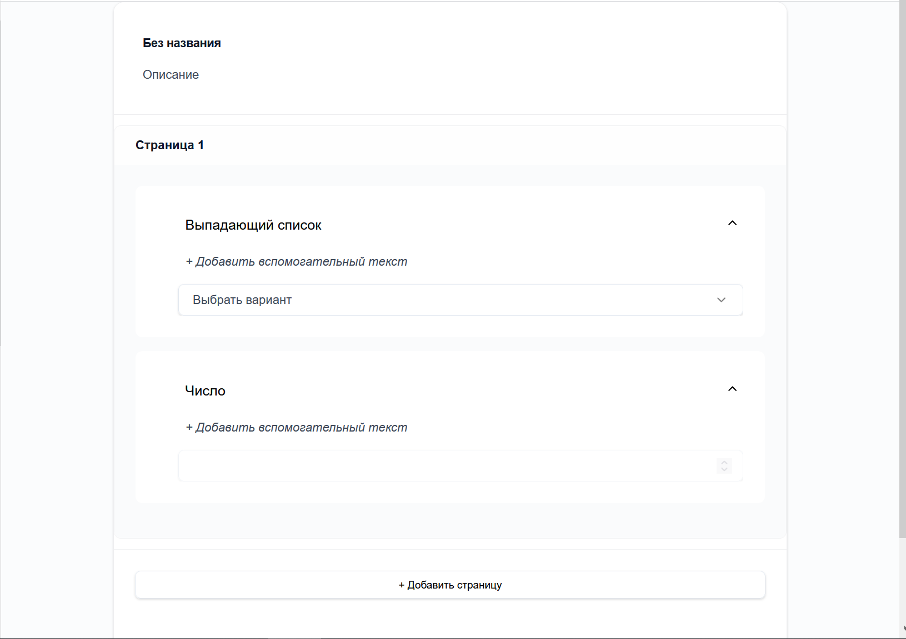

### Поведение
На холсте можно выбирать элементы и страницы, редактировать название и описание формы, добавлять страницы, а также изменять порядок элементов и страниц.

## Правая панель

### Назначение
В правой панели представлены свойства выбранного элемента или выбранной страницы.

### Что отображается
Если выбран элемент, отображаются его настройки: заголовок, описание, обязательность, подсказки, варианты ответа и другие свойства, зависящие от типа элемента. Если выбрана страница, отображаются настройки страницы.
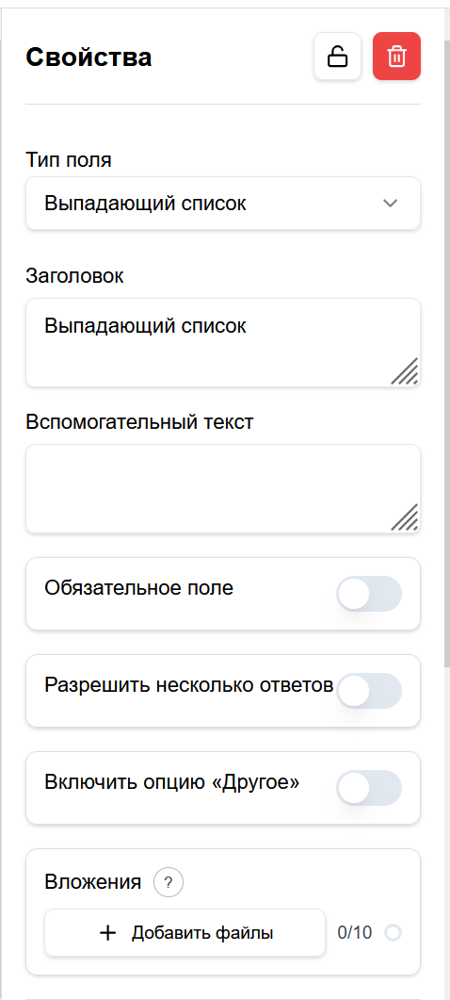

### Поведение
Изменения в правой панели применяются к выбранному элементу или странице. Для выбранных элементов доступно удаление и включение режима только для чтения. Для выбранной страницы доступно удаление страницы, настройка перехода назад и включение режима только для чтения для элементов страницы.