# Элементы формы

## Структура страницы
- Основные элементы
    - Заголовок
    - Текст
    - Число
- Элементы выбора
    - Выпадающий список
    - Флажок
    - Переключатель
- ПРодвинутые элементы
    - Дата и время
    - Электронная почта
    - Рейтинг
    - Ранжирование
    - Матрица выбора
    - Загрузка файла
- Специализированные элементы
    - ФИО
    - Номер телефона
    - Паспортные данные
    - ИНН
    - СНИЛС
    - Банковский счет
    - Страна
    - ОГРН
    - БИК

## Базовые элементы

### Заголовок

#### Назначение
Элемент используется для добавления текстового заголовка внутри формы. Он помогает разделять форму на смысловые блоки и не требует ответа от респондента.

#### Что отображается
На холсте и при прохождении формы отображается крупный текст заголовка. Если для элемента добавлены вложения, они отображаются под заголовком.

#### Свойства
- Тип поля: отображает тип элемента "Заголовок".
- Заголовок: основной текст, который видит респондент. Максимальная длина заголовка - 120 символов.
- Только для просмотра: включает режим, при котором элемент остается информационным и не используется для ввода ответа. Иконка замка в правой верхней части свойств.
- Вложения: файлы, прикрепленные к элементу. Можно добавить до 10 файлов размером до 20 MB каждый. Если прикреплено несколько изображений, можно выбрать отображение последовательным списком или слайдером.
- Условная логика: настройка зависимости отображения элемента от ответа на другой элемент. Можно выбрать элемент-источник, условие "Равно", "Не равно" или "Дан ответ", а также ожидаемое значение для условий сравнения.

#### Поведение элемента
Респондент видит заголовок как информационный текст. Элемент не создает поле для ввода ответа и не участвует в проверке обязательных ответов.

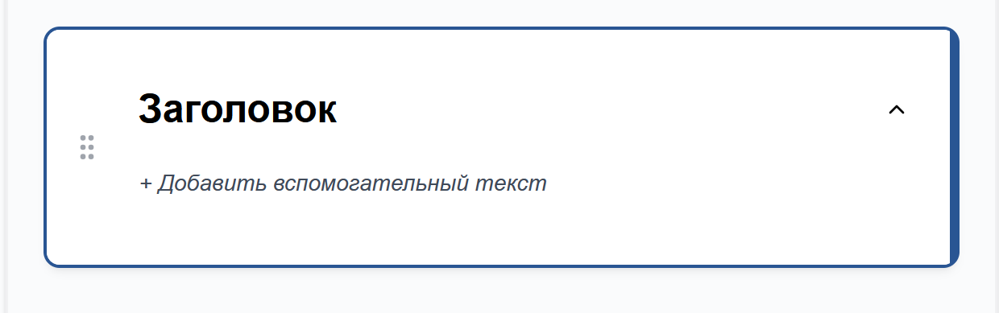
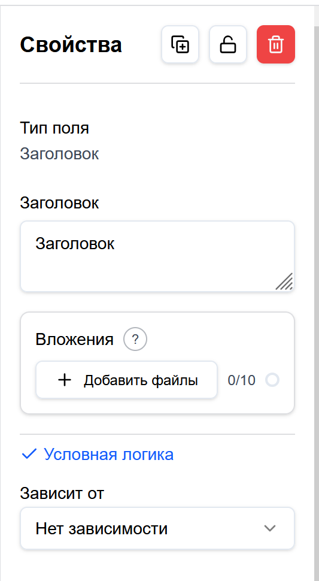

### Текст

#### Назначение
Элемент используется для ввода произвольного текстового ответа. Он подходит для коротких ответов, комментариев и развернутых текстовых пояснений.

#### Что отображается
На холсте и при прохождении формы отображается заголовок поля, вспомогательный текст, текстовая подсказка и поле ввода. Если для элемента добавлены вложения, они отображаются под полем.

#### Свойства
- Тип поля: отображает тип элемента "Текст".
- Заголовок: основной текст вопроса или подпись поля, которую видит респондент. Максимальная длина заголовка - 120 символов.
- Текст подсказка: текст внутри поля до ввода ответа. Максимальная длина подсказки - 80 символов.
- Вспомогательный текст: пояснение под заголовком элемента. Максимальная длина вспомогательного текста - 1200 символов.
- Обязательное поле: включает требование заполнить поле перед отправкой формы.
- Многострочный текст: переключает элемент между однострочным и многострочным режимом ввода.
- Максимальная длина ответа: задает ограничение длины ответа. Для однострочного режима доступно от 1 до 255 символов, для многострочного режима - от 1 до 10000 символов.
- Только для просмотра: включает режим, при котором поле нельзя заполнить. При включении этого режима обязательность поля отключается. Иконка замка в правой верхней части свойств.
- Вложения: файлы, прикрепленные к элементу. Можно добавить до 10 файлов размером до 20 MB каждый. Если прикреплено несколько изображений, можно выбрать отображение последовательным списком или слайдером.
- Правильные ответы: список значений, которые считаются правильными при автоматической проверке.
- Баллы за правильный ответ: количество баллов, начисляемое за правильный ответ.
- Условная логика: настройка зависимости отображения элемента от ответа на другой элемент. Можно выбрать элемент-источник, условие "Равно", "Не равно" или "Дан ответ", а также ожидаемое значение для условий сравнения.

#### Поведение элемента
Респондент вводит текст в поле. В однострочном режиме ответ ограничен коротким вводом, в многострочном режиме поле позволяет вводить длинный текст. Если поле обязательное, пустой ответ не проходит проверку.

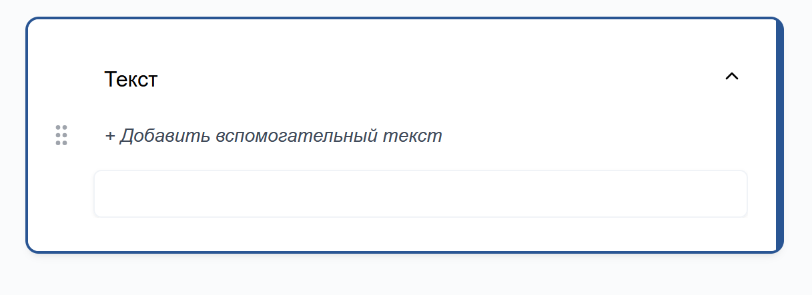
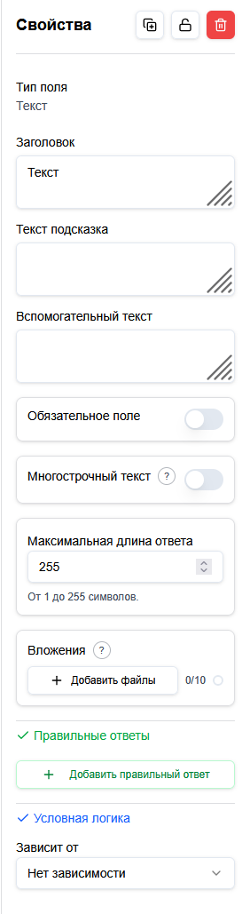

### Число

#### Назначение
Элемент используется для ввода числового ответа. Он подходит для количества, возраста, суммы, оценки в числовом виде и других числовых значений.

#### Что отображается
На холсте и при прохождении формы отображается заголовок поля, вспомогательный текст, текстовая подсказка и поле ввода числа. Если для элемента добавлены вложения, они отображаются под полем.

#### Свойства
- Тип поля: отображает тип элемента "Число".
- Заголовок: основной текст вопроса или подпись поля, которую видит респондент. Максимальная длина заголовка - 120 символов.
- Текст подсказка: текст внутри поля до ввода ответа. Максимальная длина подсказки - 80 символов.
- Вспомогательный текст: пояснение под заголовком элемента. Максимальная длина вспомогательного текста - 1200 символов.
- Обязательное поле: включает требование заполнить поле перед отправкой формы.
- Разрешить десятичные дроби: разрешает ввод чисел с десятичной частью.
- Только для просмотра: включает режим, при котором поле нельзя заполнить. При включении этого режима обязательность поля отключается. Иконка замка в правой верхней части свойств.
- Вложения: файлы, прикрепленные к элементу. Можно добавить до 10 файлов размером до 20 MB каждый. Если прикреплено несколько изображений, можно выбрать отображение последовательным списком или слайдером.
- Правильные ответы: список числовых значений, которые считаются правильными при автоматической проверке.
- Баллы за правильный ответ: количество баллов, начисляемое за правильный ответ.
- Условная логика: настройка зависимости отображения элемента от ответа на другой элемент. Можно выбрать элемент-источник, условие "Равно", "Не равно" или "Дан ответ", а также ожидаемое значение для условий сравнения.

#### Поведение элемента
Респондент вводит число в поле. Если десятичные дроби запрещены, поле принимает только целочисленный ввод. Если поле обязательное, пустой ответ не проходит проверку.

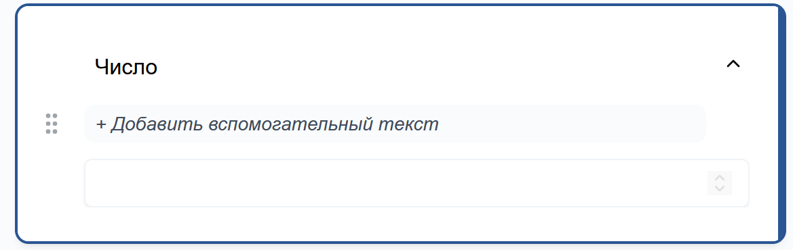
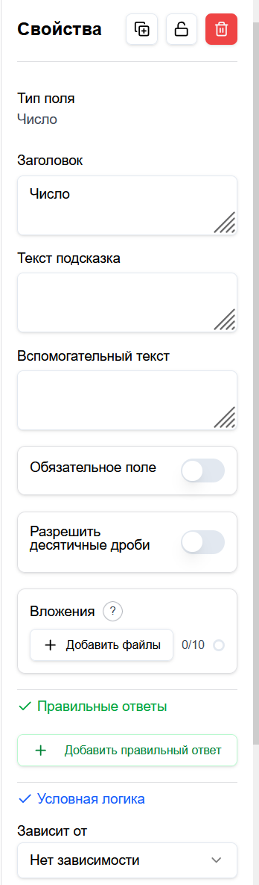

## Элементы выбора

### Выпадающий список

#### Назначение
Элемент используется для выбора ответа из раскрывающегося списка вариантов. Он подходит для компактного выбора одного или нескольких значений.

#### Что отображается
На холсте и при прохождении формы отображается заголовок поля, вспомогательный текст и раскрывающийся список. Если для элемента добавлены вложения, они отображаются под списком.

#### Свойства
- Тип поля: отображает тип элемента "Выпадающий список". Элемент можно преобразовать в "Флажок" или "Переключатель".
- Заголовок: основной текст вопроса или подпись поля, которую видит респондент. Максимальная длина заголовка - 120 символов.
- Вспомогательный текст: пояснение под заголовком элемента. Максимальная длина вспомогательного текста - 1200 символов.
- Обязательное поле: включает требование выбрать ответ перед отправкой формы.
- Разрешить несколько ответов: позволяет выбрать несколько вариантов в одном списке.
- Включить опцию "Другое": добавляет вариант для собственного ответа респондента.
- Варианты ответов: список доступных значений. Варианты можно добавлять, изменять и удалять.
- Только для просмотра: включает режим, при котором список нельзя заполнить. При включении этого режима обязательность поля отключается.
- Вложения: файлы, прикрепленные к элементу. Можно добавить до 10 файлов размером до 20 MB каждый. Если прикреплено несколько изображений, можно выбрать отображение последовательным списком или слайдером.
- Правильные ответы: варианты, которые считаются правильными при автоматической проверке. Для одиночного выбора задается один правильный вариант, для множественного выбора можно задать несколько правильных вариантов.
- Баллы за правильный ответ: количество баллов, начисляемое за правильный ответ.
- Условная логика: настройка зависимости отображения элемента от ответа на другой элемент. Можно выбрать элемент-источник, условие "Равно", "Не равно" или "Дан ответ", а также ожидаемое значение для условий сравнения.

#### Поведение элемента
Респондент открывает список и выбирает вариант ответа. Если включен множественный выбор, можно выбрать несколько значений. Если включена опция "Другое", респондент может ввести собственный вариант.

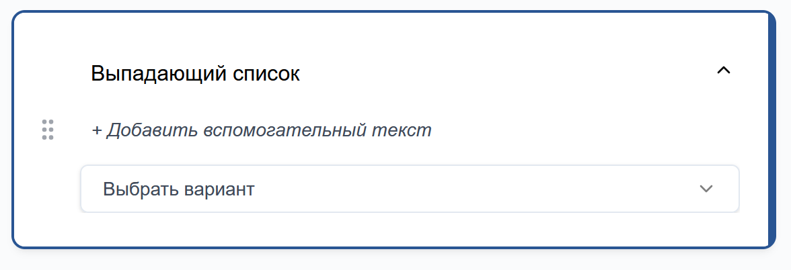
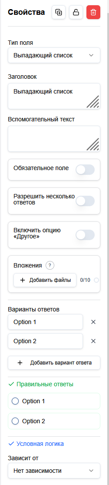

### Флажок

#### Назначение
Элемент используется для выбора одного или нескольких вариантов из списка. Он подходит для вопросов, где допустимо отметить несколько ответов.

#### Что отображается
На холсте и при прохождении формы отображается заголовок поля, вспомогательный текст и список вариантов с флажками. Если для элемента добавлены вложения, они отображаются под списком.

#### Свойства
- Тип поля: отображает тип элемента "Флажок". Элемент можно преобразовать в "Выпадающий список" или "Переключатель".
- Заголовок: основной текст вопроса или подпись поля, которую видит респондент. Максимальная длина заголовка - 120 символов.
- Вспомогательный текст: пояснение под заголовком элемента. Максимальная длина вспомогательного текста - 1200 символов.
- Обязательное поле: включает требование выбрать хотя бы один ответ перед отправкой формы.
- Включить опцию "Другое": добавляет вариант для собственного ответа респондента.
- Варианты ответов: список доступных значений. Варианты можно добавлять, изменять и удалять.
- Только для просмотра: включает режим, при котором флажки нельзя отметить. При включении этого режима обязательность поля отключается.
- Вложения: файлы, прикрепленные к элементу. Можно добавить до 10 файлов размером до 20 MB каждый. Если прикреплено несколько изображений, можно выбрать отображение последовательным списком или слайдером.
- Правильные ответы: варианты, которые считаются правильными при автоматической проверке. Можно задать один или несколько правильных вариантов.
- Баллы за правильный ответ: количество баллов, начисляемое за правильный ответ.
- Условная логика: настройка зависимости отображения элемента от ответа на другой элемент. Можно выбрать элемент-источник, условие "Равно", "Не равно" или "Дан ответ", а также ожидаемое значение для условий сравнения.

#### Поведение элемента
Респондент отмечает один или несколько флажков. Если включена опция "Другое", респондент может отметить ее и ввести собственный вариант ответа.

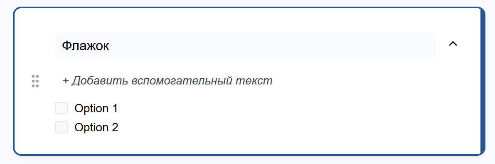
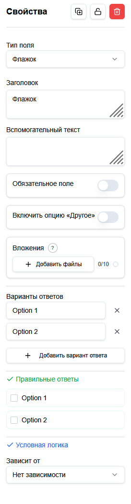

### Переключатель

#### Назначение
Элемент используется для выбора одного варианта из списка. Он подходит для вопросов, где разрешен только один ответ.

#### Что отображается
На холсте и при прохождении формы отображается заголовок поля, вспомогательный текст и список вариантов с переключателями. Если для элемента добавлены вложения, они отображаются под списком.

#### Свойства
- Тип поля: отображает тип элемента "Переключатель". Элемент можно преобразовать в "Выпадающий список" или "Флажок".
- Заголовок: основной текст вопроса или подпись поля, которую видит респондент. Максимальная длина заголовка - 120 символов.
- Вспомогательный текст: пояснение под заголовком элемента. Максимальная длина вспомогательного текста - 1200 символов.
- Обязательное поле: включает требование выбрать ответ перед отправкой формы.
- Включить опцию "Другое": добавляет вариант для собственного ответа респондента.
- Варианты ответов: список доступных значений. Варианты можно добавлять, изменять и удалять.
- Только для просмотра: включает режим, при котором переключатель нельзя выбрать. При включении этого режима обязательность поля отключается.
- Вложения: файлы, прикрепленные к элементу. Можно добавить до 10 файлов размером до 20 MB каждый. Если прикреплено несколько изображений, можно выбрать отображение последовательным списком или слайдером.
- Правильные ответы: вариант, который считается правильным при автоматической проверке.
- Баллы за правильный ответ: количество баллов, начисляемое за правильный ответ.
- Условная логика: настройка зависимости отображения элемента от ответа на другой элемент. Можно выбрать элемент-источник, условие "Равно", "Не равно" или "Дан ответ", а также ожидаемое значение для условий сравнения.

#### Поведение элемента
Респондент выбирает один вариант из списка. Если включена опция "Другое", респондент может выбрать ее и ввести собственный вариант ответа.

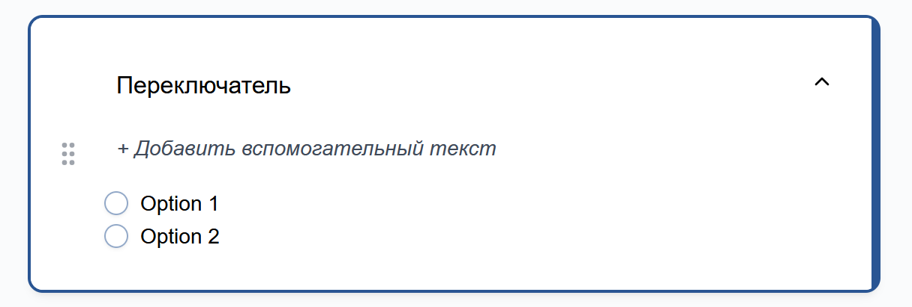
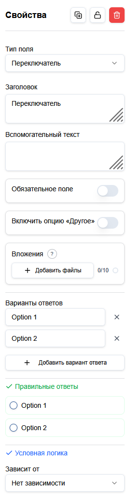

## Расширенные элементы

### Дата и время

#### Назначение
Элемент используется для ввода даты, времени или даты и времени вместе.

#### Что отображается
На холсте и при прохождении формы отображается заголовок поля, вспомогательный текст, поле выбора даты и поле выбора времени. Если для элемента добавлены вложения, они отображаются под полями.

#### Свойства
- Тип поля: отображает тип элемента "Дата и время".
- Заголовок: основной текст вопроса или подпись поля, которую видит респондент. Максимальная длина заголовка - 120 символов.
- Вспомогательный текст: пояснение под заголовком элемента. Максимальная длина вспомогательного текста - 1200 символов.
- Убрать дату: скрывает поле выбора даты. Переключатель недоступен, если уже скрыто поле времени.
- Убрать время: скрывает поле выбора времени. Переключатель недоступен, если уже скрыто поле даты.
- Только для просмотра: включает режим, при котором дату и время нельзя выбрать.
- Вложения: файлы, прикрепленные к элементу. Можно добавить до 10 файлов размером до 20 MB каждый. Если прикреплено несколько изображений, можно выбрать отображение последовательным списком или слайдером.
- Условная логика: настройка зависимости отображения элемента от ответа на другой элемент. Можно выбрать элемент-источник, условие "Равно", "Не равно" или "Дан ответ", а также ожидаемое значение для условий сравнения.

#### Поведение элемента
Респондент выбирает дату через поле даты и время через поле времени. Нельзя одновременно скрыть дату и время, потому что в этом случае элемент не сможет принять ответ.

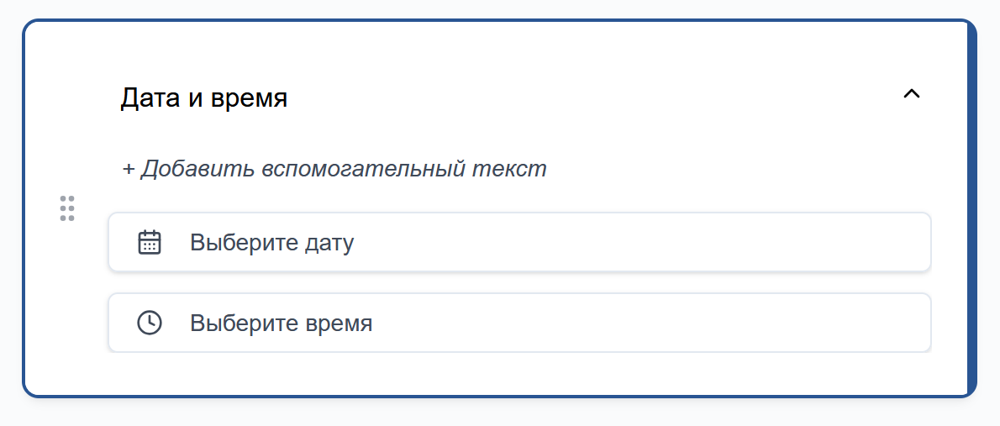
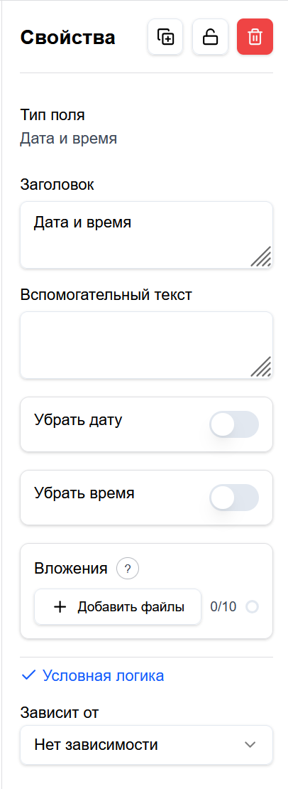

### Электронная почта

#### Назначение
Элемент используется для ввода адреса электронной почты.

#### Что отображается
На холсте и при прохождении формы отображается заголовок поля, вспомогательный текст, текстовая подсказка и поле ввода email. Если для элемента добавлены вложения, они отображаются под полем.

#### Свойства
- Тип поля: отображает тип элемента "Электронная почта".
- Заголовок: основной текст вопроса или подпись поля, которую видит респондент. Максимальная длина заголовка - 120 символов.
- Текст подсказка: текст внутри поля до ввода ответа. Максимальная длина подсказки - 80 символов.
- Вспомогательный текст: пояснение под заголовком элемента. Максимальная длина вспомогательного текста - 1200 символов.
- Обязательное поле: включает требование заполнить поле перед отправкой формы.
- Разрешенные домены: список доменов, разделенных запятыми. Если список заполнен, адрес должен относиться к одному из указанных доменов.
- Только для просмотра: включает режим, при котором поле нельзя заполнить. При включении этого режима обязательность поля отключается.
- Вложения: файлы, прикрепленные к элементу. Можно добавить до 10 файлов размером до 20 MB каждый. Если прикреплено несколько изображений, можно выбрать отображение последовательным списком или слайдером.
- Условная логика: настройка зависимости отображения элемента от ответа на другой элемент. Можно выбрать элемент-источник, условие "Равно", "Не равно" или "Дан ответ", а также ожидаемое значение для условий сравнения.

#### Поведение элемента
Респондент вводит email в текстовое поле. Ответ проверяется на формат адреса электронной почты. Если указаны разрешенные домены, адрес с другим доменом не проходит проверку.

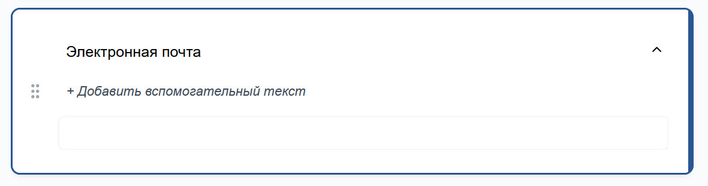
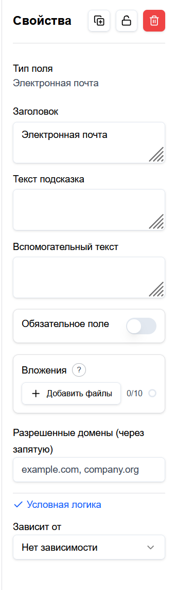

### Рейтинг

#### Назначение
Элемент используется для выбора числовой оценки по шкале.

#### Что отображается
На холсте и при прохождении формы отображается заголовок поля, вспомогательный текст и ряд кнопок с оценками от 1 до максимального значения. Если для элемента добавлены вложения, они отображаются под рейтингом.

#### Свойства
- Тип поля: отображает тип элемента "Рейтинг".
- Заголовок: основной текст вопроса или подпись поля, которую видит респондент. Максимальная длина заголовка - 120 символов.
- Вспомогательный текст: пояснение под заголовком элемента. Максимальная длина вспомогательного текста - 1200 символов.
- Максимальная оценка: верхняя граница шкалы рейтинга. Значение задается от 1 до 10.
- Только для просмотра: включает режим, при котором оценку нельзя выбрать.
- Вложения: файлы, прикрепленные к элементу. Можно добавить до 10 файлов размером до 20 MB каждый. Если прикреплено несколько изображений, можно выбрать отображение последовательным списком или слайдером.
- Правильные ответы: оценки, которые считаются правильными при автоматической проверке. Значения должны находиться в диапазоне от 1 до максимальной оценки.
- Баллы за правильный ответ: количество баллов, начисляемое за правильный ответ.
- Условная логика: настройка зависимости отображения элемента от ответа на другой элемент. Можно выбрать элемент-источник, условие "Равно", "Не равно" или "Дан ответ", а также ожидаемое значение для условий сравнения.

#### Поведение элемента
Респондент нажимает кнопку с нужной оценкой. Выбранная оценка подсвечивается как текущий ответ.

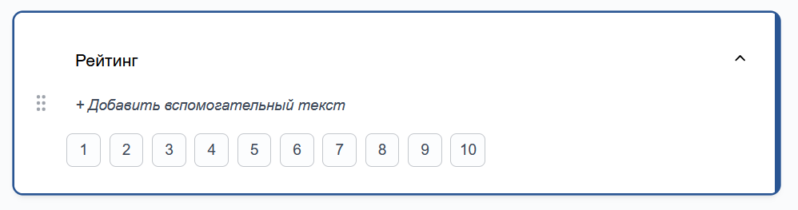
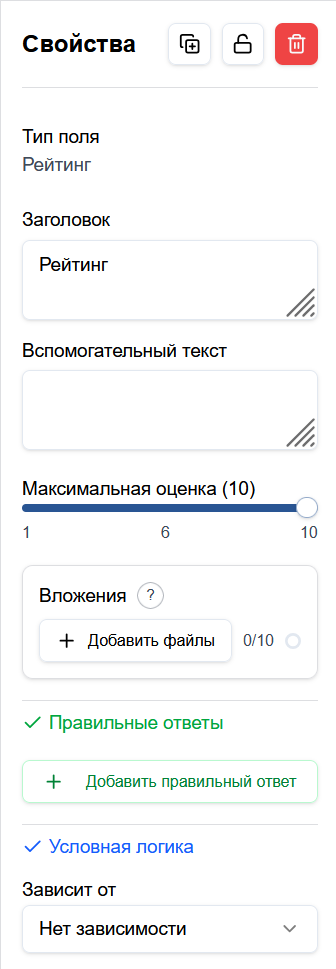

### Ранжирование

#### Назначение
Элемент используется для упорядочивания вариантов ответа. Он подходит для вопросов, где нужно расставить элементы по приоритету или предпочтению.

#### Что отображается
На холсте и при прохождении формы отображается заголовок поля, вспомогательный текст и список вариантов, которые можно перетаскивать. Если для элемента добавлены вложения, они отображаются под списком.

#### Свойства
- Тип поля: отображает тип элемента "Ранжирование".
- Заголовок: основной текст вопроса или подпись поля, которую видит респондент. Максимальная длина заголовка - 120 символов.
- Вспомогательный текст: пояснение под заголовком элемента. Максимальная длина вспомогательного текста - 1200 символов.
- Обязательное поле: включает требование заполнить элемент перед отправкой формы.
- Варианты ответов: список значений, которые респондент должен упорядочить. Варианты можно добавлять, изменять и удалять, если правильный порядок не зафиксирован.
- Только для просмотра: включает режим, при котором порядок вариантов нельзя изменить. При включении этого режима обязательность поля отключается.
- Вложения: файлы, прикрепленные к элементу. Можно добавить до 10 файлов размером до 20 MB каждый. Если прикреплено несколько изображений, можно выбрать отображение последовательным списком или слайдером.
- Правильные ответы: правильный порядок вариантов для автоматической проверки. Порядок фиксируется перетаскиванием вариантов и сохранением текущей последовательности.
- Баллы за правильный ответ: количество баллов, начисляемое за правильный порядок.
- Условная логика: настройка зависимости отображения элемента от ответа на другой элемент. Можно выбрать элемент-источник, условие "Равно", "Не равно" или "Дан ответ", а также ожидаемое значение для условий сравнения.

#### Поведение элемента
Респондент перетаскивает варианты и располагает их в нужном порядке. Ответом считается итоговая последовательность вариантов.

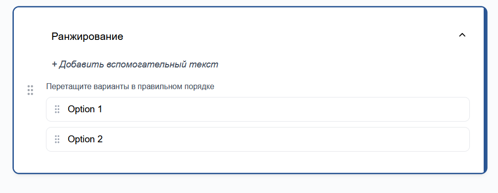
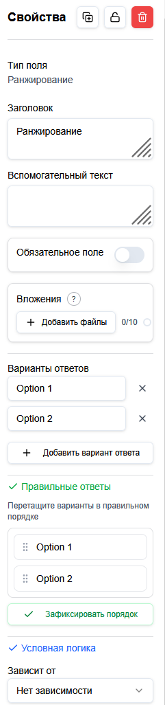

### Матрица выбора

#### Назначение
Элемент используется для сбора ответов в таблице со строками и столбцами. Он подходит для оценочных таблиц, сопоставлений и набора однотипных вопросов.

#### Что отображается
На холсте и при прохождении формы отображается заголовок поля, вспомогательный текст, строки матрицы, столбцы матрицы и ячейки для ответа. Если для элемента добавлены вложения, они отображаются под матрицей.

#### Свойства
- Тип поля: отображает тип элемента "Матрица выбора".
- Заголовок: основной текст вопроса или подпись поля, которую видит респондент. Максимальная длина заголовка - 120 символов.
- Вспомогательный текст: пояснение под заголовком элемента. Максимальная длина вспомогательного текста - 1200 символов.
- Обязательное поле: включает требование заполнить матрицу перед отправкой формы.
- Тип поля матрицы: определяет тип ответа в ячейках. Доступны переключатель, флажок, число и текстовое поле.
- Минимальное значение: нижняя граница числового ответа в ячейках. Свойство отображается для числового типа матрицы.
- Максимальное значение: верхняя граница числового ответа в ячейках. Свойство отображается для числового типа матрицы.
- Максимальная длина текста: ограничение длины текстового ответа в ячейках. Свойство отображается для текстового типа матрицы.
- Строки матрицы: список строк таблицы. Строки можно добавлять, изменять и удалять.
- Столбцы матрицы: список столбцов таблицы. Столбцы можно добавлять, изменять и удалять.
- Только для просмотра: включает режим, при котором матрицу нельзя заполнить. При включении этого режима обязательность поля отключается.
- Вложения: файлы, прикрепленные к элементу. Можно добавить до 10 файлов размером до 20 MB каждый. Если прикреплено несколько изображений, можно выбрать отображение последовательным списком или слайдером.
- Правильные ответы: ячейки, которые считаются правильными при автоматической проверке. Для ячеек используется формат "строка:столбец", например "3:1".
- Режим проверки: определяет, как проверяются правильные ячейки. Можно засчитать ответ при выборе хотя бы одной правильной ячейки или только при выборе всех правильных ячеек.
- Баллы за всю матрицу: количество баллов, начисляемое за полностью правильное заполнение матрицы.
- Распределение баллов: настройка баллов по ячейкам, строкам, столбцам или всей матрице.
- Условная логика: настройка зависимости отображения элемента от ответа на другой элемент. Можно выбрать элемент-источник, условие "Равно", "Не равно" или "Дан ответ", а также ожидаемое значение для условий сравнения.

#### Поведение элемента
Респондент заполняет таблицу в соответствии с типом ячеек. Для переключателей доступен один выбор в строке, для флажков можно выбрать несколько значений, для числового типа вводятся числа, для текстового типа вводится текст.

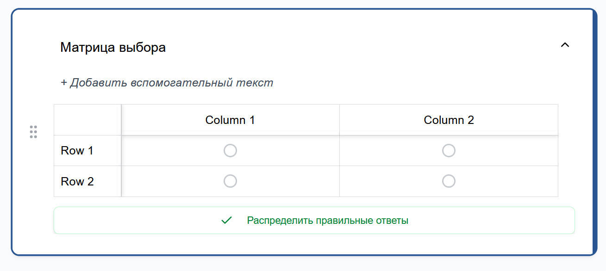
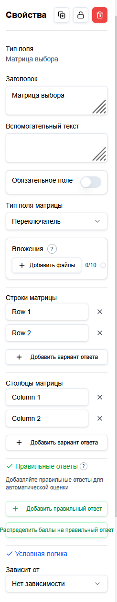

### Загрузка файла

#### Назначение
Элемент используется для загрузки файлов респондентом.

#### Что отображается
На холсте и при прохождении формы отображается заголовок поля, вспомогательный текст и область загрузки файлов. Если для элемента добавлены вложения, они отображаются под областью загрузки.

#### Свойства
- Тип поля: отображает тип элемента "Загрузка файла".
- Заголовок: основной текст вопроса или подпись поля, которую видит респондент. Максимальная длина заголовка - 120 символов.
- Вспомогательный текст: пояснение под заголовком элемента. Максимальная длина вспомогательного текста - 1200 символов.
- Максимальный размер файла: ограничение размера одного файла. Значение задается от 1 до 20 MB.
- Макс. файлов: максимальное количество файлов, которое можно загрузить. Значение задается от 1 до 10.
- Принимаемые типы: список допустимых расширений или MIME-типов, разделенных запятыми, например ".pdf, .jpg, .png".
- Только для просмотра: включает режим, при котором файлы нельзя загрузить.
- Вложения: файлы, прикрепленные к элементу. Можно добавить до 10 файлов размером до 20 MB каждый. Если прикреплено несколько изображений, можно выбрать отображение последовательным списком или слайдером.
- Условная логика: настройка зависимости отображения элемента от ответа на другой элемент. Можно выбрать элемент-источник, условие "Равно", "Не равно" или "Дан ответ", а также ожидаемое значение для условий сравнения.

#### Поведение элемента
Респондент выбирает файлы для загрузки. Файлы проверяются по количеству, размеру и допустимым типам. Загруженные файлы отображаются списком, и их можно удалить до отправки, если поле доступно для заполнения.

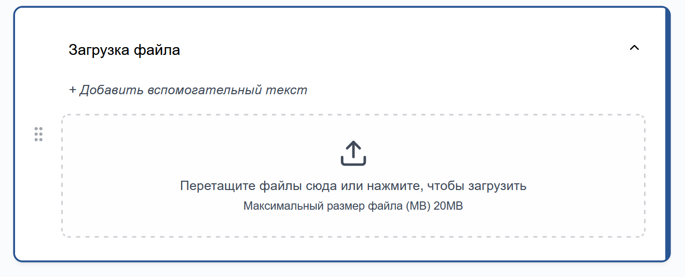
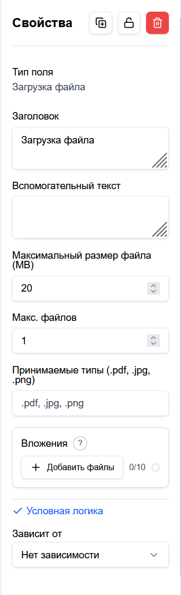

## Специализированные элементы

### ФИО

#### Назначение
Элемент используется для ввода фамилии, имени и отчества.

#### Что отображается
На холсте и при прохождении формы отображается заголовок элемента, вспомогательный текст и отдельные поля "Фамилия", "Имя", "Отчество (при наличии)". Если для элемента добавлены вложения, они отображаются под полями.

#### Свойства
- Тип поля: отображает тип элемента "ФИО".
- Заголовок: основной текст вопроса или подпись элемента, которую видит респондент. Максимальная длина заголовка - 120 символов.
- Текст подсказка: текст внутри полей до ввода ответа. Максимальная длина подсказки - 80 символов.
- Вспомогательный текст: пояснение под заголовком элемента. Максимальная длина вспомогательного текста - 1200 символов.
- Только для просмотра: включает режим, при котором поля нельзя заполнить.
- Вложения: файлы, прикрепленные к элементу. Можно добавить до 10 файлов размером до 20 MB каждый. Если прикреплено несколько изображений, можно выбрать отображение последовательным списком или слайдером.
- Условная логика: настройка зависимости отображения элемента от ответа на другой элемент. Можно выбрать элемент-источник, условие "Равно", "Не равно" или "Дан ответ", а также ожидаемое значение для условий сравнения.

#### Поведение элемента
Респондент вводит фамилию, имя и отчество. Фамилия и имя являются обязательными частями элемента, отчество можно не заполнять.

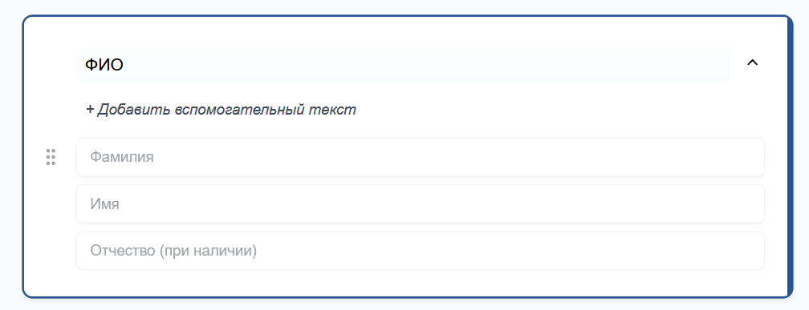
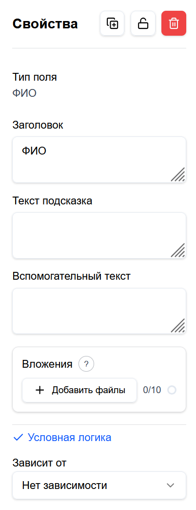

### Номер телефона

#### Назначение
Элемент используется для ввода номера телефона.

#### Что отображается
На холсте и при прохождении формы отображается заголовок поля, вспомогательный текст, текстовая подсказка и поле ввода телефона. Если для элемента добавлены вложения, они отображаются под полем.

#### Свойства
- Тип поля: отображает тип элемента "Номер телефона".
- Заголовок: основной текст вопроса или подпись поля, которую видит респондент. Максимальная длина заголовка - 120 символов.
- Текст подсказка: текст внутри поля до ввода ответа. Максимальная длина подсказки - 80 символов.
- Вспомогательный текст: пояснение под заголовком элемента. Максимальная длина вспомогательного текста - 1200 символов.
- Обязательное поле: включает требование заполнить поле перед отправкой формы.
- Только для просмотра: включает режим, при котором поле нельзя заполнить. При включении этого режима обязательность поля отключается.
- Вложения: файлы, прикрепленные к элементу. Можно добавить до 10 файлов размером до 20 MB каждый. Если прикреплено несколько изображений, можно выбрать отображение последовательным списком или слайдером.
- Условная логика: настройка зависимости отображения элемента от ответа на другой элемент. Можно выбрать элемент-источник, условие "Равно", "Не равно" или "Дан ответ", а также ожидаемое значение для условий сравнения.

#### Поведение элемента
Респондент вводит российский номер телефона. Ввод нормализуется к формату с кодом +7 и проверяется на 11 цифр.

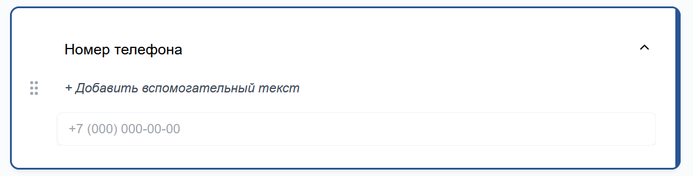
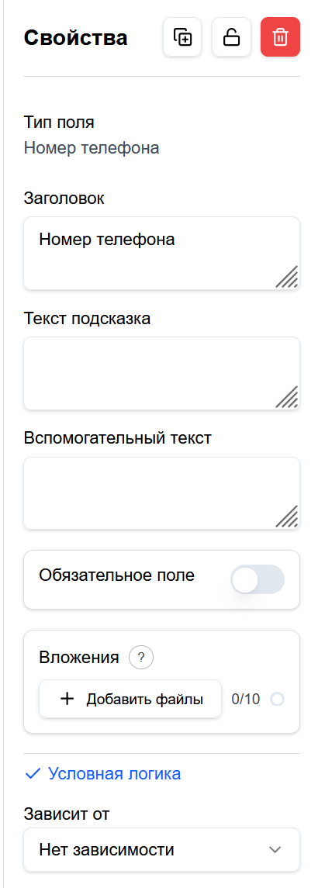

### Паспортные данные

#### Назначение
Элемент используется для ввода паспортных данных респондента.

#### Что отображается
На холсте и при прохождении формы отображается заголовок элемента, вспомогательный текст и набор паспортных полей. Если для элемента добавлены вложения, они отображаются под полями.

#### Свойства
- Тип поля: отображает тип элемента "Паспортные данные".
- Заголовок: основной текст вопроса или подпись элемента, которую видит респондент. Максимальная длина заголовка - 120 символов.
- Вспомогательный текст: пояснение под заголовком элемента. Максимальная длина вспомогательного текста - 1200 символов.
- Скрыть ФИО: скрывает поля фамилии, имени и отчества.
- Скрыть пол: скрывает поле выбора пола.
- Скрыть дату рождения: скрывает поле даты рождения.
- Скрыть серию и номер: скрывает поле серии и номера паспорта.
- Скрыть кем выдан: скрывает поле органа выдачи.
- Скрыть дату выдачи: скрывает поле даты выдачи.
- Скрыть код подразделения: скрывает поле кода подразделения.
- Скрыть место рождения: скрывает поле места рождения.
- Только для просмотра: включает режим, при котором паспортные поля нельзя заполнить.
- Вложения: файлы, прикрепленные к элементу. Можно добавить до 10 файлов размером до 20 MB каждый. Если прикреплено несколько изображений, можно выбрать отображение последовательным списком или слайдером.
- Условная логика: настройка зависимости отображения элемента от ответа на другой элемент. Можно выбрать элемент-источник, условие "Равно", "Не равно" или "Дан ответ", а также ожидаемое значение для условий сравнения.

#### Поведение элемента
Респондент заполняет видимые паспортные поля. Серия и номер принимают 10 цифр, код подразделения принимает 6 цифр. В элементе должна оставаться видимой хотя бы одна группа паспортных данных.

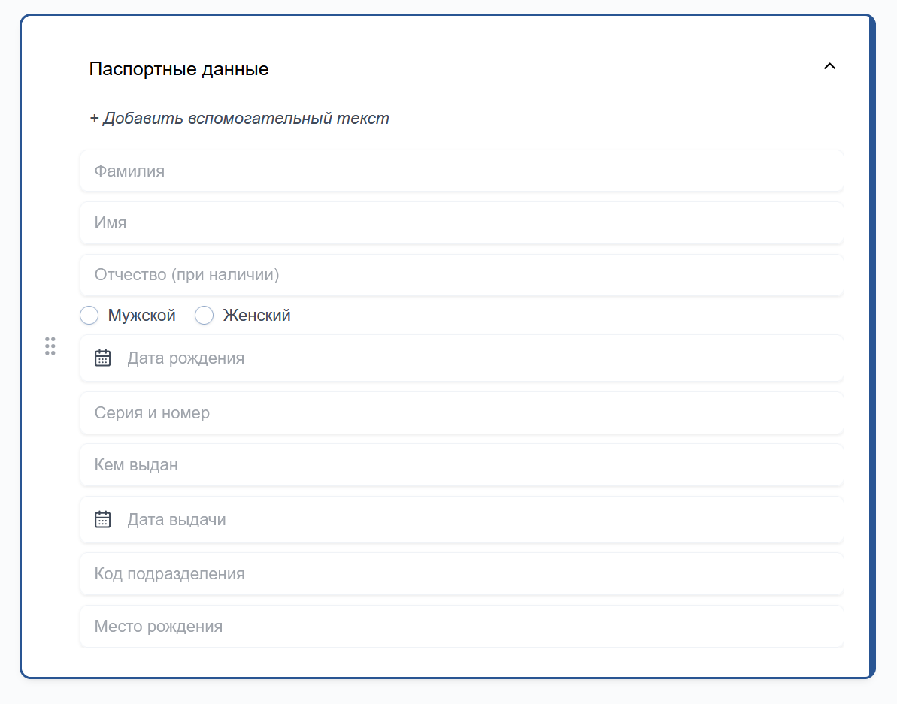
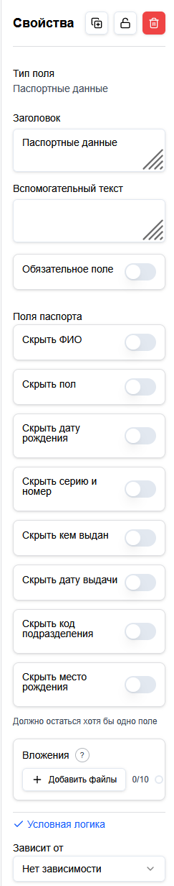

### ИНН

#### Назначение
Элемент используется для ввода ИНН физического или юридического лица.

#### Что отображается
На холсте и при прохождении формы отображается заголовок поля, вспомогательный текст и поле ввода ИНН. Если для элемента добавлены вложения, они отображаются под полем.

#### Свойства
- Тип поля: отображает тип элемента "ИНН".
- Заголовок: основной текст вопроса или подпись поля, которую видит респондент. Максимальная длина заголовка - 120 символов.
- Вспомогательный текст: пояснение под заголовком элемента. Максимальная длина вспомогательного текста - 1200 символов.
- Обязательное поле: включает требование заполнить поле перед отправкой формы.
- Юридическое лицо: переключает формат ИНН. Для юридического лица используется 10 цифр, для физического лица используется 12 цифр.
- Только для просмотра: включает режим, при котором поле нельзя заполнить. При включении этого режима обязательность поля отключается.
- Вложения: файлы, прикрепленные к элементу. Можно добавить до 10 файлов размером до 20 MB каждый. Если прикреплено несколько изображений, можно выбрать отображение последовательным списком или слайдером.
- Условная логика: настройка зависимости отображения элемента от ответа на другой элемент. Можно выбрать элемент-источник, условие "Равно", "Не равно" или "Дан ответ", а также ожидаемое значение для условий сравнения.

#### Поведение элемента
Респондент вводит только цифры. Ответ проверяется на длину: 10 цифр для юридического лица или 12 цифр для физического лица.

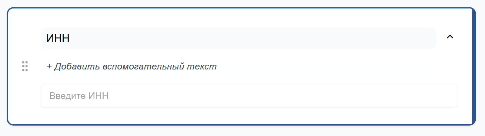
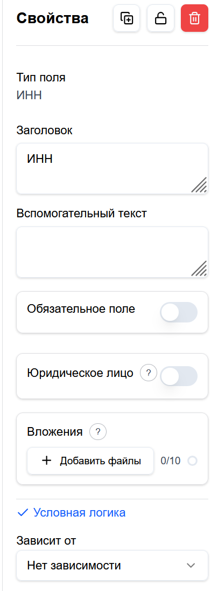

### СНИЛС

#### Назначение
Элемент используется для ввода СНИЛС.

#### Что отображается
На холсте и при прохождении формы отображается заголовок поля, вспомогательный текст и поле ввода СНИЛС. Если для элемента добавлены вложения, они отображаются под полем.

#### Свойства
- Тип поля: отображает тип элемента "СНИЛС".
- Заголовок: основной текст вопроса или подпись поля, которую видит респондент. Максимальная длина заголовка - 120 символов.
- Текст подсказка: текст внутри поля до ввода ответа. Максимальная длина подсказки - 80 символов.
- Вспомогательный текст: пояснение под заголовком элемента. Максимальная длина вспомогательного текста - 1200 символов.
- Обязательное поле: включает требование заполнить поле перед отправкой формы.
- Только для просмотра: включает режим, при котором поле нельзя заполнить. При включении этого режима обязательность поля отключается.
- Вложения: файлы, прикрепленные к элементу. Можно добавить до 10 файлов размером до 20 MB каждый. Если прикреплено несколько изображений, можно выбрать отображение последовательным списком или слайдером.
- Условная логика: настройка зависимости отображения элемента от ответа на другой элемент. Можно выбрать элемент-источник, условие "Равно", "Не равно" или "Дан ответ", а также ожидаемое значение для условий сравнения.

#### Поведение элемента
Респондент вводит СНИЛС. Ввод форматируется как "000-000-000 00" и проверяется на 11 цифр, повторяющиеся цифры в основной части и контрольную сумму.

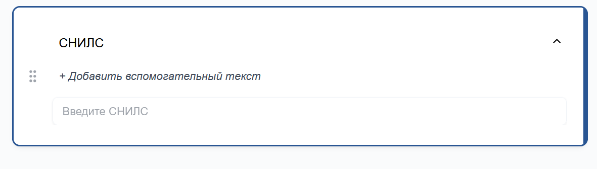
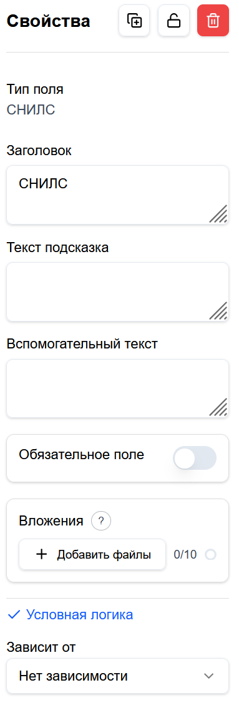

### Банковский счет

#### Назначение
Элемент используется для ввода номера банковского счета.

#### Что отображается
На холсте и при прохождении формы отображается заголовок поля, вспомогательный текст, текстовая подсказка и поле ввода банковского счета. Если для элемента добавлены вложения, они отображаются под полем.

#### Свойства
- Тип поля: отображает тип элемента "Банковский счет".
- Заголовок: основной текст вопроса или подпись поля, которую видит респондент. Максимальная длина заголовка - 120 символов.
- Текст подсказка: текст внутри поля до ввода ответа. Максимальная длина подсказки - 80 символов.
- Вспомогательный текст: пояснение под заголовком элемента. Максимальная длина вспомогательного текста - 1200 символов.
- Обязательное поле: включает требование заполнить поле перед отправкой формы.
- Только для просмотра: включает режим, при котором поле нельзя заполнить. При включении этого режима обязательность поля отключается.
- Вложения: файлы, прикрепленные к элементу. Можно добавить до 10 файлов размером до 20 MB каждый. Если прикреплено несколько изображений, можно выбрать отображение последовательным списком или слайдером.
- Условная логика: настройка зависимости отображения элемента от ответа на другой элемент. Можно выбрать элемент-источник, условие "Равно", "Не равно" или "Дан ответ", а также ожидаемое значение для условий сравнения.

#### Поведение элемента
Респондент вводит номер банковского счета. Ввод принимает только цифры и проверяется на длину 20 цифр.

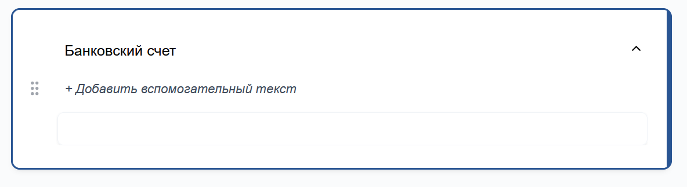
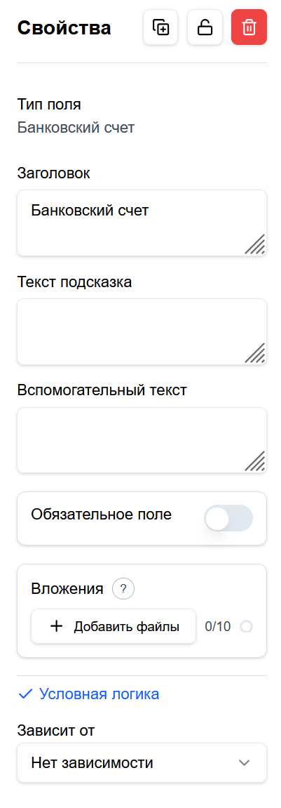

### Страна

#### Назначение
Элемент используется для выбора страны из фиксированного списка.

#### Что отображается
На холсте и при прохождении формы отображается заголовок поля, вспомогательный текст и выпадающий список стран. Если для элемента добавлены вложения, они отображаются под списком.

#### Свойства
- Тип поля: отображает тип элемента "Страна".
- Заголовок: основной текст вопроса или подпись поля, которую видит респондент. Максимальная длина заголовка - 120 символов.
- Вспомогательный текст: пояснение под заголовком элемента. Максимальная длина вспомогательного текста - 1200 символов.
- Обязательное поле: включает требование выбрать страну перед отправкой формы.
- Только для просмотра: включает режим, при котором страну нельзя выбрать. При включении этого режима обязательность поля отключается.
- Вложения: файлы, прикрепленные к элементу. Можно добавить до 10 файлов размером до 20 MB каждый. Если прикреплено несколько изображений, можно выбрать отображение последовательным списком или слайдером.
- Условная логика: настройка зависимости отображения элемента от ответа на другой элемент. Можно выбрать элемент-источник, условие "Равно", "Не равно" или "Дан ответ", а также ожидаемое значение для условий сравнения.

#### Поведение элемента
Респондент выбирает страну из списка. Список стран фиксирован и локализуется автоматически.

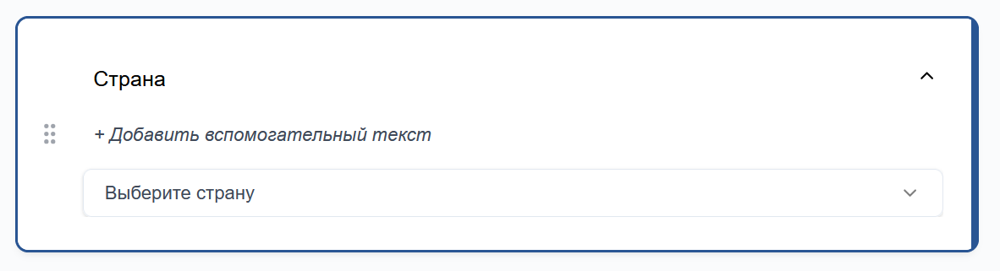
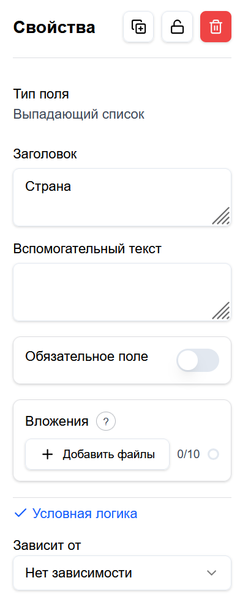

### ОГРН

#### Назначение
Элемент используется для ввода ОГРН юридического лица или ОГРНИП индивидуального предпринимателя.

#### Что отображается
На холсте и при прохождении формы отображается заголовок поля, вспомогательный текст и поле ввода ОГРН или ОГРНИП. Если для элемента добавлены вложения, они отображаются под полем.

#### Свойства
- Тип поля: отображает тип элемента "ОГРН".
- Заголовок: основной текст вопроса или подпись поля, которую видит респондент. Максимальная длина заголовка - 120 символов.
- Вспомогательный текст: пояснение под заголовком элемента. Максимальная длина вспомогательного текста - 1200 символов.
- Обязательное поле: включает требование заполнить поле перед отправкой формы.
- ОГРНИП: переключает формат номера. Для ОГРН используется 13 цифр, для ОГРНИП используется 15 цифр.
- Только для просмотра: включает режим, при котором поле нельзя заполнить. При включении этого режима обязательность поля отключается.
- Вложения: файлы, прикрепленные к элементу. Можно добавить до 10 файлов размером до 20 MB каждый. Если прикреплено несколько изображений, можно выбрать отображение последовательным списком или слайдером.
- Условная логика: настройка зависимости отображения элемента от ответа на другой элемент. Можно выбрать элемент-источник, условие "Равно", "Не равно" или "Дан ответ", а также ожидаемое значение для условий сравнения.

#### Поведение элемента
Респондент вводит только цифры. Ответ проверяется на длину: 13 цифр для ОГРН или 15 цифр для ОГРНИП.

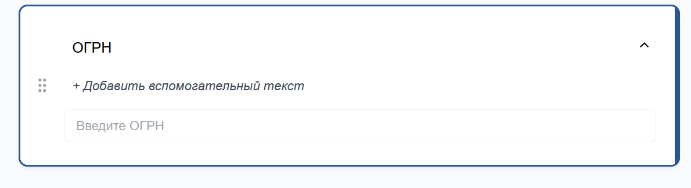
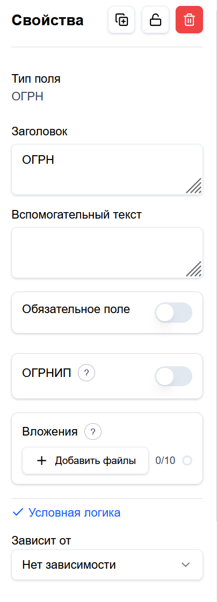

### БИК

#### Назначение
Элемент используется для ввода банковского идентификационного кода.

#### Что отображается
На холсте и при прохождении формы отображается заголовок поля, вспомогательный текст и поле ввода БИК. Если для элемента добавлены вложения, они отображаются под полем.

#### Свойства
- Тип поля: отображает тип элемента "БИК".
- Заголовок: основной текст вопроса или подпись поля, которую видит респондент. Максимальная длина заголовка - 120 символов.
- Вспомогательный текст: пояснение под заголовком элемента. Максимальная длина вспомогательного текста - 1200 символов.
- Обязательное поле: включает требование заполнить поле перед отправкой формы.
- Только для просмотра: включает режим, при котором поле нельзя заполнить. При включении этого режима обязательность поля отключается.
- Вложения: файлы, прикрепленные к элементу. Можно добавить до 10 файлов размером до 20 MB каждый. Если прикреплено несколько изображений, можно выбрать отображение последовательным списком или слайдером.
- Условная логика: настройка зависимости отображения элемента от ответа на другой элемент. Можно выбрать элемент-источник, условие "Равно", "Не равно" или "Дан ответ", а также ожидаемое значение для условий сравнения.

#### Поведение элемента
Респондент вводит БИК. Ввод принимает только цифры и проверяется на длину 9 цифр.

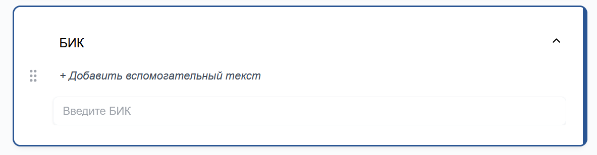
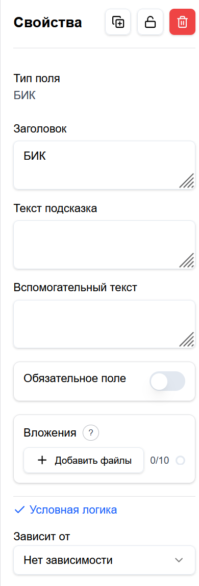
