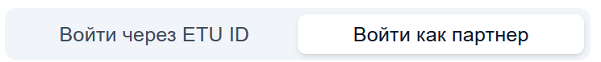
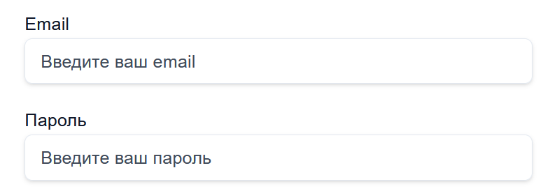

# Страница входа

## Структура страницы
- Основная область страницы
    - Кнопка локализации
    - Выбор варианта входа
    - Поля для входа
    - Кнопка входа

## Основная область страницы

### Кнопка локализации

#### Назначение
Перевод содержимого страницы на английский и на русский.

### Выбор варианта входа

#### Назначение
Доступен выбор: войти как партнер, войти через ETU ID. На данный момент реализован вход только как партнер, в дальнейшем планируется добавить вход по ETU ID.

### Поля для входа

#### Назначение
Поля для входа в сервис, в зависимости от выбранного варианта входа.
Если был выбран вариант "Войти как партнер", то будут предложены два поля: email и пароль.

Если был выбран вариант "Войти через ETU ID", то полей не будет, а вход будет автоматически происходить через сервисы ETU ID.

### Кнопка входа

#### Назначение
Кнопка входа в сервис. В зависимости от предложенных вариантов будет кнопка "Войти как партнер" и использованием email и пароля или "Войти через ETU ID".