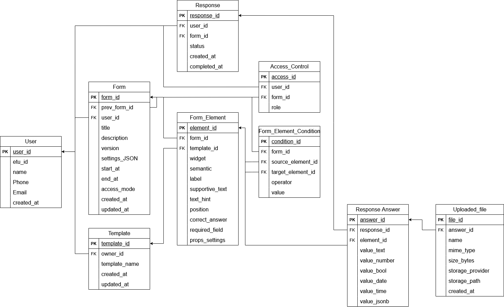

# DB

Краткое описание схемы БД проекта ETU-Forms по ER-диаграмме и инструкции по диагностике.

## ER-диаграмма


## Сущности и поля

### User
| Поле | Тип | Ключ | Ограничения | Суть |
| --- | --- | --- | --- | --- |
| user_id | INT | PK | NOT NULL | Первичный ключ пользователя |
| etu_id | VARCHAR(50) |  | UNIQUE | Внутренний идентификатор ETU, если есть |
| name | VARCHAR(100) |  | NOT NULL | Имя пользователя |
| phone | VARCHAR(20) |  | NULL | Контактный телефон |
| email | VARCHAR(100) |  | UNIQUE, NOT NULL | Email для связи или логина |
| created_at | TIMESTAMP |  | DEFAULT | Дата создания записи |

**Замечание**
В базе данных таблица называется App_user

**Правила целостности**
- `user_id` уникален и обязателен.
- `email` уникален и обязателен.
- `etu_id` уникален, если задан.

### Form
| Поле | Тип | Ключ | Ограничения | Суть |
| --- | --- | --- | --- | --- |
| form_id | INT | PK | NOT NULL | Первичный ключ формы |
| prev_form_id | INT | FK | REFERENCES Form(form_id) | Ссылка на предыдущую версию формы |
| user_id | INT | FK | REFERENCES User(user_id), NOT NULL | Владелец формы (автор) |
| title | VARCHAR(255) |  | NOT NULL | Название формы |
| description | TEXT |  | NULL | Описание формы |
| version | INT |  | DEFAULT | Номер версии формы |
| start_at | TIMESTAMP |  | NULL | Начало приема ответов |
| end_at | TIMESTAMP |  | NULL | Конец приема ответов |
| access_mode | FORM_ACCESS_MODE |  | DEFAULT | Режим доступа к форме |
| status | FORM_STATUS |  | DEFAULT | Статус формы |
| expires_at | TIMESTAMP |  | NULL/DEFAULT | Время жизни черновика (temp) |
| deleted_at | TIMESTAMP |  | NULL | Время мягкого удаления |
| created_at | TIMESTAMP |  | DEFAULT | Дата создания формы |
| updated_at | TIMESTAMP |  | DEFAULT | Дата последнего обновления |

**Домены и перечисления**
- FORM_ACCESS_MODE: Private (по ссылке), Unauthenticated (публичная).
- FORM_STATUS: temp (черновик), submitted (опубликована), deleted (удалена).

**Правила целостности**
- `user_id` обязателен и ссылается на `User.user_id`.
- `prev_form_id` ссылается на `Form.form_id` и может быть NULL.
- Если `status = temp` и `expires_at` в прошлом, форма переводится в `deleted` (soft-delete).

### Response
| Поле | Тип | Ключ | Ограничения | Суть |
| --- | --- | --- | --- | --- |
| response_id | INT | PK | NOT NULL | Первичный ключ ответа |
| user_id | INT | FK | REFERENCES User(user_id), NOT NULL | Пользователь, заполняющий форму |
| form_id | INT | FK | REFERENCES Form(form_id), NOT NULL | Форма, к которой относится ответ |
| status | RESPONSE_STATUS |  | TBD | Статус ответа |
| created_at | TIMESTAMP |  | DEFAULT | Время создания ответа |
| completed_at | TIMESTAMP |  | NULL | Время отправки; NULL, пока ответ не отправлен |

**Домены и перечисления**
- **RESPONSE_STATUS**: Статус попытки заполнения формы (сущности `Response`), определяющий этап жизненного цикла ответа и правила обработки данных.
  - `draft` — Черновик: пользователь начал заполнять форму, но ещё не отправил. Значения ответов могут быть неполными; допускается сохранение промежуточного состояния.
  - `submitted` — Отправлено: пользователь завершил заполнение и отправил форму. Данные фиксируются как итоговые и используются для статистики/экспорта/просмотра результатов.
  - `cancelled` — Отозвано: ранее отправленный ответ был отозван пользователем (или администратором) и больше не считается действительным. Такие данные не участвуют в статистике и не отображаются как актуальный результат, но могут сохраняться в системе для аудита.

**Правила целостности**
- `user_id` и `form_id` обязательны и ссылаются на соответствующие таблицы.
- `completed_at` заполняется при финальной отправке ответа.

### Response_Answer
| Поле | Тип | Ключ | Ограничения | Суть |
| --- | --- | --- | --- | --- |
| answer_id | INT | PK | NOT NULL | Первичный ключ ответа на элемент |
| response_id | INT | FK | REFERENCES Response(response_id), NOT NULL | Ссылка на ответ формы |
| element_id | INT | FK | REFERENCES Form_Element(element_id), NOT NULL | Элемент формы, на который дан ответ |
| value_text | TEXT |  | NULL | Текстовое значение |
| value_number | NUMERIC |  | NULL | Числовое значение |
| value_bool | BOOLEAN |  | NULL | Логическое значение |
| value_date | DATE |  | NULL | Значение даты |
| value_time | TIME |  | NULL | Значение времени |
| value_jsonb | JSONB |  | NULL | Структурное значение для сложных типов |

**Правила целостности**
- `response_id` и `element_id` обязательны и ссылаются на соответствующие таблицы.
- Желательно хранить только одно из `value_*` для одного ответа элемента.

### Access_Control
| Поле | Тип | Ключ | Ограничения | Суть |
| --- | --- | --- | --- | --- |
| access_id | INT | PK | NOT NULL | Первичный ключ доступа |
| user_id | INT | FK | REFERENCES User(user_id), NOT NULL | Пользователь, которому дан доступ |
| form_id | INT | FK | REFERENCES Form(form_id), NOT NULL | Форма, к которой выдан доступ |
| role | FORM_ACCESS_ROLE |  | NOT NULL | Роль пользователя на форме |

**Домены и перечисления**
- FORM_ACCESS_ROLE (access_role):
  - `editor` — может редактировать форму и управлять её настройками/структурой.
  - `participant` — может просматривать форму и заполнять/отправлять ответы, без права редактирования структуры.

**Правила целостности**
- `user_id` и `form_id` обязательны и ссылаются на соответствующие таблицы.
- Владелец формы не дублируется в `Access_Control`.

### Form_Element
| Поле | Тип | Ключ | Ограничения | Суть |
| --- | --- | --- | --- | --- |
| element_id | INT | PK | NOT NULL | Первичный ключ элемента |
| form_id | INT | FK | REFERENCES Form(form_id), NULL | Форма, если элемент принадлежит конкретной форме |
| template_id | INT | FK | REFERENCES Template(template_id), NULL | Шаблон, если элемент принадлежит шаблону |
| widget | WIDGET_TYPE |  | NOT NULL | Тип виджета элемента |
| semantic | SEMANTIC_TYPE |  | NULL | Семантический подтип поля |
| label | VARCHAR(255) |  | NOT NULL | Название элемента |
| supportive_text | TEXT |  | NULL | Вспомогательный текст |
| text_hint | TEXT |  | NULL | Текст-заглушка |
| position | INT |  | NULL | Позиция элемента в форме |
| correct_answer | JSONB |  | NULL | Правильный ответ для проверяемых полей |
| required_field | BOOLEAN |  | NULL | Флаг обязательного заполнения |
| other_settings | JSONB |  | NULL | Частные настройки свойств элемента |
| file_ids | INT[] |  | DEFAULT '{}' | Список file_id прикреплённых файлов (до 10) |

**Примечания по props_settings**
- Параметр `readOnly` хранится в `props_settings` и определяет режим элемента без возможности ввода ответа, т.е. доступный только для чтения.
- При значении `readOnly: true` поле не участвует в проверке обязательности, даже если в `required_field` установлено `true`.
- В редакторе формы параметры `readOnly` и `required_field` обрабатываются как взаимоисключающие:
  - при включении `readOnly` значение `required_field` принудительно устанавливается в `false`;
  - при включении `required_field` значение `readOnly` принудительно устанавливается в `false`.

**Домены и перечисления**
- WIDGET_TYPE: heading, static_text, number_input, text_input, select, checkbox, radio, datetime, email_input, rating, ranking, matrix, file_upload.
- SEMANTIC_TYPE: full_name, phone, email, passport, inn, snils, bank_account, country, ogrn, bik.

**Правила целостности**
- Заполнено ровно одно из `form_id` или `template_id`.

### Form_Element_Condition
| Поле | Тип | Ключ | Ограничения | Суть |
| --- | --- | --- | --- | --- |
| condition_id | INT | PK | NOT NULL | Первичный ключ условия |
| form_id | INT | FK | REFERENCES Form(form_id), NULL | Форма, где действует условие |
| source_element_id | INT | FK | REFERENCES Form_Element(element_id), NOT NULL | Исходный элемент (от какого вопроса) |
| target_element_id | INT | FK | REFERENCES Form_Element(element_id), NOT NULL | Целевой элемент (какой вопрос показываем) |
| operator | CONDITION_OPERATOR |  | NOT NULL | Оператор сравнения |
| value | JSONB |  | NULL | Значение для сравнения |

**Домены и перечисления**
- CONDITION_OPERATOR: equals, not_equals, in, not_in, greater_than, less_than, contains, answered. (Больше значений можем появится из-за задачи #25)

**Правила целостности**
- `form_id`, `source_element_id`, `target_element_id` ссылаются на соответствующие таблицы.

### Template
| Поле | Тип | Ключ | Ограничения | Суть |
| --- | --- | --- | --- | --- |
| template_id | INT | PK | NOT NULL | Первичный ключ шаблона |
| owner_id | INT | FK | REFERENCES User(user_id), NOT NULL | Владелец шаблона |
| template_name | VARCHAR(255) |  | NOT NULL | Название шаблона |
| created_at | TIMESTAMP |  | DEFAULT CURRENT_TIMESTAMP | Дата создания |
| updated_at | TIMESTAMP |  | DEFAULT CURRENT_TIMESTAMP | Дата обновления |

**Правила целостности**
- `owner_id` обязателен и ссылается на `User.user_id`.

### Uploaded_file
| Поле | Тип | Ключ | Ограничения | Суть |
| --- | --- | --- | --- | --- |
| file_id | INT | PK | NOT NULL | Первичный ключ файла |
| answer_id | INT | FK | REFERENCES Response_Answer(answer_id), NULL | Ответ на элемент, к которому относится файл (NULL для файлов, прикреплённых к элементам формы) |
| name | VARCHAR(512) |  | NOT NULL | Имя файла |
| mime_type | VARCHAR(255) |  | NOT NULL | MIME-тип файла |
| size_bytes | BIGINT |  | NOT NULL, CHECK (size_bytes >= 0) | Размер файла в байтах |
| storage_provider | VARCHAR(50) |  | DEFAULT 'local' | Провайдер хранилища |
| storage_path | TEXT |  | NOT NULL | Путь в хранилище |
| access_token | VARCHAR(64) |  | NOT NULL, UNIQUE | Токен доступа к файлу |
| created_at | TIMESTAMP |  | DEFAULT CURRENT_TIMESTAMP | Дата загрузки |

**Домены и перечисления**
- storage_provider (enum): `local` (по умолчанию; хранение на сервере приложения).

**Правила целостности**
- `answer_id` обязателен и ссылается на `Response_Answer.answer_id`.
- `size_bytes` не может быть меньше 0.

**Жизненный цикл файла**
- При прикреплении файла к элементу он получает статус `TEMP`, а поле `expires_at` устанавливается в `now() + 24h`.
- Если через 24 часа статус остаётся `TEMP`, файл удаляется с диска. Запись в БД остаётся для истории. Для удаления можно использовать `backend/scripts/cleanup_temp_files.py`.
- Если пользователь отправил форму с прикреплённым файлом, статус меняется на `SUBMITTED`, а `expires_at` становится `NULL`.
- Если файл удаляется по любой причине, статус меняется на `DELETED`, запись в БД остаётся, файл на диске удаляется.

**Хранилище файлов**
- Файлы сохраняются в директории `FILES_ROOT`. По умолчанию это `./uploads`, а в docker-compose — `/var/lib/postgresql/data/uploads` (тот же том, что и у БД).

## Связи
- User 1—M Form (Form.user_id)
- User 1—M Response (Response.user_id)
- User 1—M Access_Control (Access_Control.user_id)
- Form 1—M Response (Response.form_id)
- Form 1—M Form_Element (Form_Element.form_id)
- Form 1—M Access_Control (Access_Control.form_id)
- Form 1—M Form_Element_Condition (Form_Element_Condition.form_id)
- Form 1—M Response_Answer (Response_Answer.response_id)
- Form 1—M Form (Form.prev_form_id)
- Template 1—M Form_Element (Form_Element.template_id)
- Form_Element 1—M Response_Answer (Response_Answer.element_id)
- Form_Element 1—M Form_Element_Condition (source_element_id, target_element_id)
- Response_Answer 1—M Uploaded_file (Uploaded_file.answer_id)
- Form_Element 1—M Uploaded_file (Form_Element.file_ids)

## Диагностика БД

### Требования
- Docker и запущенный контейнер `postgres_db`.
- Доступ к пользователю и базе (по умолчанию: `user`/`db`).

### Adminer
Adminer проброшен только на хост, без доступа снаружи. Доступен по адресу `http://127.0.0.1:8081`. Для просмотра базы данных при входе следует выставить следующие настройки:
- Движок - PostgreSQL
- Сервер - etu-forms-postgres_db
- Имя пользователя, пароль, база данных - из env файла

Если нужно иногда открыть с ноутбука на удалённый сервер — делается SSH-туннелем:
```bash
ssh -L 8081:127.0.0.1:8081 user@server
```

### Примечание для разработчиков
- Если в локальной БД появляются "нерабочие" таблицы (битая схема, старые миграции или неконсистентные данные), можно пересоздать том БД командой `docker compose down -v` и поднять сервис заново. Это удаляет все данные в томе и заставляет БД стартовать с чистого состояния.
В проде так делать нельзя — команда удаляет тома и приводит к полной потере данных.
- Не забывайте про ; в конце SQL команд

### Подключение через psql

#### Windows
```bash
docker exec -it postgres_db psql -U user -d db
```
Если используете Git Bash/MinTTY и интерактивный режим не открывается, попробуйте:
```bash
winpty docker exec -it postgres_db psql -U user -d db
```

#### Linux/macOS
```bash
docker exec -it postgres_db psql -U user -d db
```

### Быстрые команды psql
| Команда | Назначение |
| --- | --- |
| `\dt` | Список таблиц |
| `\d+ table_name` | Подробная информация о таблице |
| `\d` | Список объектов (таблицы, sequence, view) |
| `\l` | Список баз данных |
| `\du` | Список ролей и пользователей |
| `\dn` | Список схем (schemas) |
| `\x` | Переключение расширенного вывода (on/off) |
| `\q` | Выход из psql |
| `\pset pager off` | Отключение постраничного вывода |

### Примеры

**Список таблиц**:


**Запуск SQL-команд**: введите SQL и нажмите Enter.


**Расширенный вывод**:
```text
\x on
\x off
```

