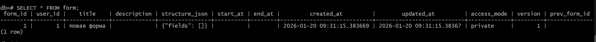

# Диагностика бд

## Диагностика в консоли

На Windows:
```bash
winpty docker exec -it postgres_db psql -U user -d db
```

На linux - без winpty

Эта среда называется psql.

### Команды
- `\dt` -	Все таблицы
- `\d+ table_name` -	Структура таблицы с индексами
- `\d` -	Все объекты БД (таблицы, sequence, индексы)
- `\l` -	Список всех баз данных
- `\du` -	Пользователи и их права
- `\dn` -	Схемы (schemas)
- `\x` -	Включить/выключить расширенный вывод (для длинных строк)
- `\q` -	Выйти из psql
**Пример**:


**Примечание**: Если таблица большая, то чтобы вывести следующие строки нажимайте Enter.

### Проверка данных в таблице

- Чтобы проверить данные в таблице. Прямо в консоль пишите SQL команды


- Использование `\x`: В дефолтном состоянии `\x` выключено.
    Чтобы включить или выключить используйте `\x on/off`
    

