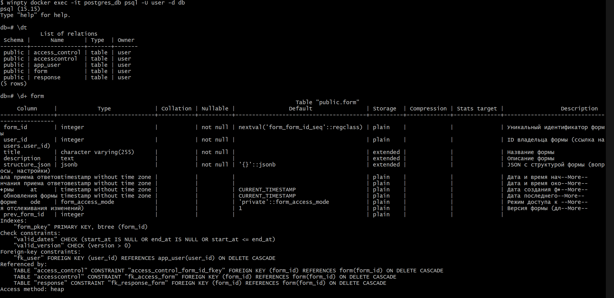
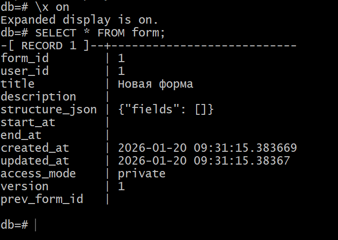

# Руководство по диагностике базы данных

Краткое руководство по диагностике базы данных проекта ETU-Forms: подключение, проверка структуры и базовые команды.

## Назначение
Документ описывает, как быстро подключиться к БД и выполнить диагностику (таблицы, схемы, роли, базовые запросы).

## Требования
- Docker и запущенный контейнер `postgres_db`.
- Доступ к пользователю и базе (по умолчанию: `user`/`db`).

## Подключение через psql

### Windows
```bash
docker exec -it postgres_db psql -U user -d db
```
Если используете Git Bash/MinTTY и интерактивный режим не открывается, попробуйте:
```bash
winpty docker exec -it postgres_db psql -U user -d db
```

### Linux/macOS
```bash
docker exec -it postgres_db psql -U user -d db
```

## Быстрые команды psql
| Команда | Назначение |
| --- | --- |
| `\dt` | Список таблиц |
| `\d+ table_name` | Подробная информация о таблице |
| `\d` | Список объектов (таблицы, sequence, view) |
| `\l` | Список баз данных |
| `\du` | Список ролей и пользователей |
| `\dn` | Список схем (schemas) |
| `\x` | Переключение расширенного вывода (on/off) |
| `\q` | Выход из psql |

## Примеры

**Список таблиц**:


**Запуск SQL-команд**: введите SQL и нажмите Enter.


**Расширенный вывод**:
```text
\x on
\x off
```

